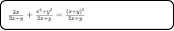

# Markdown 总结 
## 宗旨&目标

- Markdown 的宗旨是实现易读易写。
- Markdown 的目标是成为一个适用于网络的书写语言。

## 标题
1、Markdown 有两种标题语法：
- Setext  
- Atx

2、语法介绍
- Setext  
类 Setext 形式是用底线， = (最高阶标题) 和  _ (二阶标题)。
    ```
    Setext 实例：

    This is an H1
    ===

    This is an H2
    ---
    ```
    > 效果展示: 

    
- Atx  
类 Atx 形式是在行首插入 1 到 6 个 #, 对应标题 1 到 6 阶。
    ```
    Atx 实例：

    # H1
    ## H2
    ### H3
    #### H4
    ##### H5
    ###### H6
    ```
    > 效果展示：  
    
    


## 引用区块 （Blockquotes）

- ### 单层引用
    Markdown 使用 `>` 在每行的最前面的形式在文件中建立一个引用区块。
    ```
    引入实例：

    > 松下问童子，
    > 言师采药去。
    > 只在此山中，
    > 云深不知处。
    ```
    > 效果展示   

    

    每行开始都要写 `>` 很不爽, Markdown 提供了可以只在第一行添加 `>` 的写法，如下：
    ```
    > 松下问童子，
    言师采药去。
    只在此山中，
    云深不知处。
    ```
    > 效果展示：

    
- ### 多层嵌套
    1、Markdown 引用内可以在引用，形式是根据不同层次加上不同数量的 `>` 。

    ```
    嵌套引用实例：

    > 动物
    >> 高级动物  
    人 & 猴
    >
    >> 低级动物   
    细胞
    ```
    > 效果展示  

    
    
    2、在多层引用嵌套中，也可以使用其他的 Markdown 语法,如下所示：
    ```
    > 人
    >> - 白人  
    美国人
    >
    >> * 黑人  
    非洲人
    >
    >> + 黄人  
    中国人
    ```
    > 效果展示

    


## 列表

1、基础列表 
- 无序列表 （ * 、— 、 + ）
    ```
    * 苹果
    * 栗子

    - 橘子
    - 南瓜

    + 西瓜
    + 葡萄
    ```
    > 效果展示

    

- 有序列表（数字）
    ```
    1. 樱桃
    2. 核桃
    3. 冬瓜
    ```
    > 效果展示

    

2、缩进列表
* 列表段落缩进

    列表可以缩进，最多三个空格，项目标记后面一定接着一个空格或者制表符。
    ```
    * 列表段落一

        伸手需要一瞬间，牵手却要很多年，无论你遇见谁，他都是你生命该出现的人，绝非偶然。若无相欠，怎会相见。
    * 列表段落一

        起风的日子学会依风起舞，落雨的时候学会为自己撑起一把伞。生活有望穿秋水的期待，也会有的意想不到的欣喜。
    ```
    > 效果展示

    

* 列表内引用

    如果在列表内引用，那么 `>` 需要缩进。
    ```
    + 我是什么？
        > 是希望、是田野
    + 我渴望什么？
        > 渴望成长、渴望金钱
    ```
    > 效果展示

    

* 列表内添加代码

    如果要放代码块，则该代码块需要缩进两次，即 8 个空格或者两个制表符。

    ```
    - 代码段
        ```
        print("我是希望我是田野")
        ```
    ```

    > 效果展示

    

* 列表包含（数字-点-空格）的形式
    ```
    - 1990. 希望的田野
    - 2020. 原野的希望
    ```
    向上面的写法我们需要做处理。我们可以在点（.）的前面增加反斜线（\）.
    ```
    - 1990\. 希望的田野
    - 2020\. 原野的希望
    ```
    > 效果展示

    

## 代码块
在 Markdown 中使用 \<pre> 或者 \<code> 标签来把代码块抱起来。
+ \<pre> 的用法
    ```
    <pre>for (int i = 0; i< 6; i++>){
        print("Markdown")
    }
    </pre>
    ```
    > 效果展示

    

 - \<code> 的用法  
    ```
    <code>
    for (int i = 0; i< 6; i++>){
        print("Markdown")
    }
    </code>
    ```
    > 效过展示

    

- 4 个空格或者 1 个制表符  

    ```
       for (int i = 0; i< 6; i++>){
           print("Markdown")
       }
    ```
    > 效果展示

    

-  \``` 开始, \``` 结束

    ```
    \'```
    for (int i = 0; i< 6; i++>){
        print("Markdown")
    }
    \```
    ```
    > 效果展示

    

## 分割线
你可以使用三个以上的星号（*）、减号（-）、底线（_）建立一个分隔线,行内不能有其他东西。   

```
// 正确写法  

分隔线

--- 
分隔线
***
分隔线
___

// (错误写法)
--- 分隔线 
*** 分隔线
___ 分隔线 
```
> 效果展示


## 区段元素

- ### 连接
    行内式链接，只要在方括号后面紧接着圆括号并插入网址链接。如果要加上链接的文字（title）,只要在网址后面，用双引号把 title 文字包起来即可。

    ```
    搜索引擎 [百度](https://www.baidu.com "百度网址") 地址
    ```
    > 效果展示

    

- ### 强调

    Markdown 使用星号（*）和底线（_）作为标记强调字词的符号。用两个星号或者底线，则会转成 \<Strong>   

    ```
    // 单 * & _
    *Markdown*  
    _Swift_  
    // 双 * & _   
    **Markdown**   
    __Swift__   
    ```
    > 效果展示

    

## 代码

- 小段代码  
    如果要标记一个小段行内代码，可以使用反引号（`）包括起来。   
    ```
    日志输出 `print("日志")`, Swift 形式
    ```
    > 效果展示

      

    注意：如果要在代码区内插入反引号，你可以使用多个反引号开启和结束。      
    ```
    ``I`m is boy!``
    ```
    > 效果展示

    

- 大段代码   
    如果要引入大段代码，可以使用三个反引号。
    ```
    \```
    for (int i = 0; i< 6; i++>) {
        print("Markdown")
    }
    \```
    ```
    > 效果展示

    


## 图片
- 行内式  
    ```
    
    ```
    > 效果展示

    

    注意：如果要设置图片的宽度和高度[^2]，就要使用  标签。使用如下：
    ```
    
    ```
    > 效果展示

    


## 自动连接
- 网址

    ```
    <https://www.baidu.com>
    ```
    > 效果展示

    

- 邮件  

    ```
    <1542100658@qq.com>
    ```
    > 效果展示

    

- 行外引用  

    ```
    这是 [百度][1] 的搜索引擎。  

    [1]: https://www.baidu.com
    ```
    > 效果展示

    

## 字体

- 加粗  
要加粗文字，就要在文字的左右分别用两个 `*` 或者 `_` 包括。 
    ```
    **希望的田野**  
    __我的希望__
    ```
    > 效果展示

    

- 倾斜     
    要倾斜的文字左右分别用一个 `*` 或则 `_` 包括。

    ```
    *希望的田野*  
    _我的希望_
    ```
    > 效果展示

    

- 倾斜加粗  
    要倾斜加粗的文字，需要在文字的左右加上三个 `*` 或者 `_` .

    ```
    ***希望的田野***  
    ___我的希望___
    ```
    > 效果展示

    

- 删除线  
    要添加删除线，文字左右分别使用 `~` 包括。

    ```
    ~~希望的田野~~
    ```
    > 效果展示

    

- 颜色  
    使用 H5 的标签 \<font> 来实现的，如下：
    ```
    <font color=red>希望的田野</font>   
    <font color=blue>希望的田野</font>
    ```
    > 效果展示

    

## 表格
- Markdown 基础表  
使用竖线组成表格。其中 `|-|` 来区分表头和表的内容；以 `|-:|` 控制文字右对齐；以 `|:-:|` 控制文字居中对齐。

    ```
    | 水果        | 价格    |  数量  |
    | - | -: | :-: |
    | 香蕉        | $1      |   5    |
    | 苹果        | $1      |   6    |
    | 草莓        | $1      |   7    |
    ```
    > 效果展示

    

- \<table> 标签

    表格标题：caption   
    跨列：colspan，当某个格跨n列时，colspan ="n"  
    跨行：rowspan，当某个格跨n行时，rowspan ="n+1"

    ```
    <table>
    <tr>
    <th>姓名</th>
    <th>性别</th>
    <th>年龄</th>
    <th colspan="2">备注</th>
    <th></th>
    </tr>
    <tr>
    <td rowspan = "2">王二</td>
    <td>男</td>
    <td>19</td>
    <td colspan="2">19</td>
    <td></td>
    </tr>
    <tr>
    <td>女</td>
    <td>19</td>
    <td colspan="2">19</td>
    <td></td>
    </tr>
    </table>
    ```
    > 效果展示

    


## 特殊符号
- 图片符号
    ```
    &#10084;
    &#10003;
    &#9876;
    &#9798;
    &#9733;
    &#9726;
    &#9579;
    &#8661;
    &#8668;
    ```
    > 效果展示

    


## 注释 （hack）
- 格式1:   
    \[xx]: #(注释内容)
    ```
    [//]: #(我是注释)
    [^_^]: #(我是注释)
    ```
- 格式2:   
    [xx]: <> (注释内容)   
    ```
    [//]: <> (我是注释)
    [Mark]: <> (我是注释)
    ```
    注意： 格式中，方括号里面的内容可以随便写。它们都在页面上不显示。


## 锚点
- Markdown 中锚点的格式： 
    \[要显示的内容](#锚点的连接)
    ```
    // 例如
    点击 [标题](#标题) 就能回到标题栏目。
    ```
    点击 [标题](#标题) 就能回到标题栏目。


## 公式
- 行内公司
    要在行内使用公式，就要用 `$` 将要使用的公司包括。如下：

    ```
    物理质能公式 $E=mc^2$ 是由爱因斯坦提出的。
    ```
    > 效果展示

    


- 下标
    使用下划线(_) 来设置下标。如下：       
    ```
    炭在氧气中燃烧生成二氧化碳：$C + O^2 = CO_2$
    ```
    > 效果展示

    

- 分数
    要展示分数就要使用 `\frac{xx}{xx}` 的形式，如下：
    ```
    $\frac{2x}{2x + y} + \frac{x^2 + y^2}{2x + y} = \frac{(x + y)^2}{2x +y}$
    ```
    > 效果展示

    


- 省略号
    要使用省略号就要使用 `\cdots`,例如:
    ```
    $ 1 + 2 + 3 + \cdots + 98 + 99 + 100 = ? $
    ```
    > 效果展示

    
    
- 开根号
    开根号要使用 `\sqrt{x}` 或者 `\sqrt[n]{x}` ,解释如下:
    `\sqrt{x}` 是 X 开平方。
    `\sqrt[n]{x}` 是 X 开 n 次方。
    实例:
    ```
    $\sqrt{4} = 2$
    $\sqrt[3]{27} = 3$
    ```
    > 效果展示

    


- 矢量
    矢量使用 `\vec{x}` 来表示 X 的矢量。
    例如: 功在功移动的方向所做的功。
    ```
    $W = \vec{F} \cdot \vec{s}$
    ```
    > 效果展示

    

- 三角函数
    三角函数有 sin / cons / tan 等...
    ```
    |算式| md 写法|
    |--|:--:|
    |sin|$\sin{x}$|
    |cos|$\cos{x}$|
    |tan|$\tan{x}$|
    ```
    > 效果展示

    


    